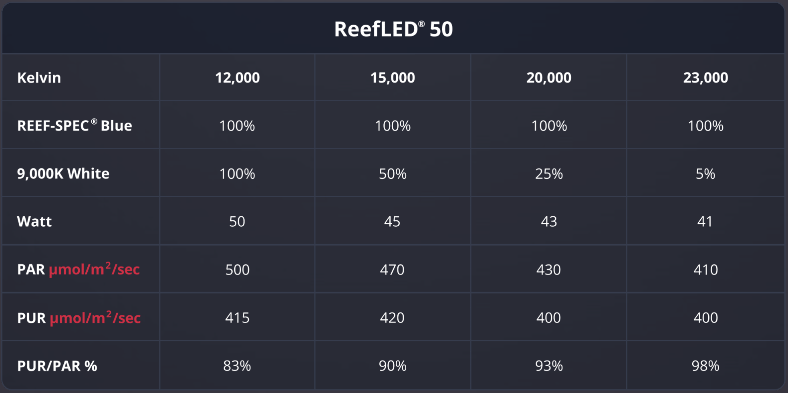
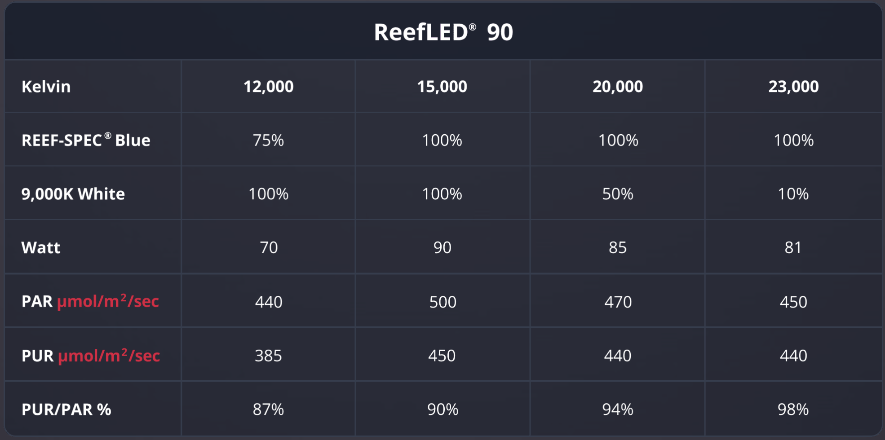
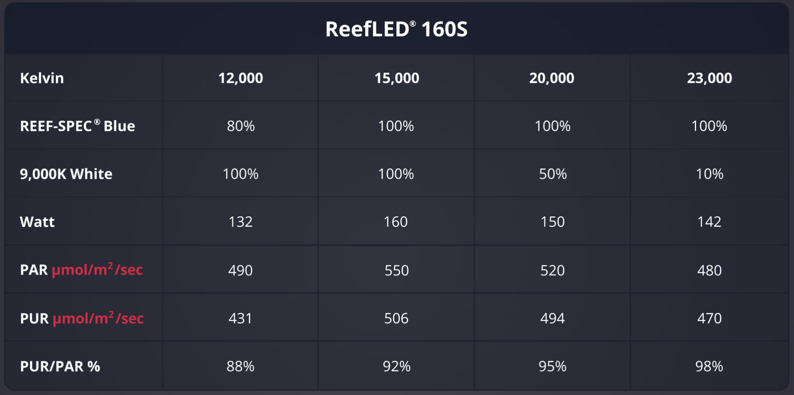

# NOTE - THIS REPOS IS DEPRECATED
See https://github.com/Elwinmage/ha-reefbeat-component for a newer integration pulling all the Red Sea components into a local-only control scheme.


# RSLED
This is a Home Assistant integration for controlling [Red Sea ReefLED lights](https://g1.redseafish.com/hardware/lighting/).

## introduction
Each ReefLED unit includes a "REEF-SPEC" blue light (a proprietary mix of blue LEDs yielding about 23k or 24k Kelvin), a 9k Kelvin white light, and a moon light.





## endpoints
I used the [proxy](proxy) while performing manual settings in the app for my RSLED90 lights. I observed the following command endpoints available through HTTP (when you send the given payload in the POST body):

### DEVICE_INFO
This simply returns a structure giving information about the device. I need it for the hw_type and hw_model, to identify which light it is.
```
{
    hw_type: "reef-lights",
    hw_model: "RSLED90",
    name: "RSLED90-xxxxxx",
    status: "unpaired",
    hwid: "xxxxxxxx"
}
```

### MANUAL
This sets the lights to the requested color. The lights stay that color until the mode call is issued. It returns the same structure with two additional values: fan and temperature - but does not seem to respond to trying to set either of them (i.e. you can't turn the fan on and off). The light color parameters are a value between 0 and 100.
```
manual : {
    "blue": 100,
    "moon": 0,
    "white": 100
}
```

### MODE
This restores the light to the automatic mode configured in the app. I did not try to chase down all of the ways to set a program, but there are endpoints for getting and setting them if you want to do that. It returns the current mode (auto, timer, or manual - in my limited testing).
```
mode : {
    mode: auto
}
```

### TIMER
This sets the light colors for the requested duration in minutes. It also returns a structure with the timer status and time remaining.
```
timer: {
    "blue": 100,
    "duration": 30,
    "moon": 0,
    "white": 100
}
```

### OTHER
I also saw two other endpoints, which might respond to commands:
```
moonphase
acclimation
```

## plan
For my purposes, I really only want the MANUAL and MODE endpoints for this integration. The plan is to create three entities for each of the lights that have brightness values, and include a service call to set the effective color temperature and brightness using the blue and white lights. I'll also build up a "photo mode", which is probably just setting a full white light for some time period. I also plan to mimic the moon phase on the third LED (probably using something from HA to get the actual moon phase).

Of note, the Red Sea website says their research suggests you basically want a 12-hour on and 12-hour off cycle, and the moon phase is included in that (though I admit to giving that some side-eye).

## testing the lights manually

Example curl commands (replace xx.xx.xx.xx with the IP address of your light):

```
curl -i -X POST -H 'Content-Type: application/json' -d '{"white": 100, "blue":50, "moon": 0 }' http://xx.xx.xx.xx/manual
curl -i -X POST -H 'Content-Type: application/json' -d '{"mode": "auto" }' http://xx.xx.xx.xx/mode
curl -i -X POST -H 'Content-Type: application/json' -d '{"white": 100, "blue":50, "moon": 0, "duration": 1 }' http://xx.xx.xx.xx/timer
```

## how to make an integration
Start at the [HA docs](https://developers.home-assistant.io/docs/creating_component_index/). I find them to be a bit light on the details, so I am also taking a [model integration](https://github.com/msp1974/HAIntegrationExamples) from Mark Parker.

## disclaimer
This is integration is not supported by or affiliated with Red Sea.
